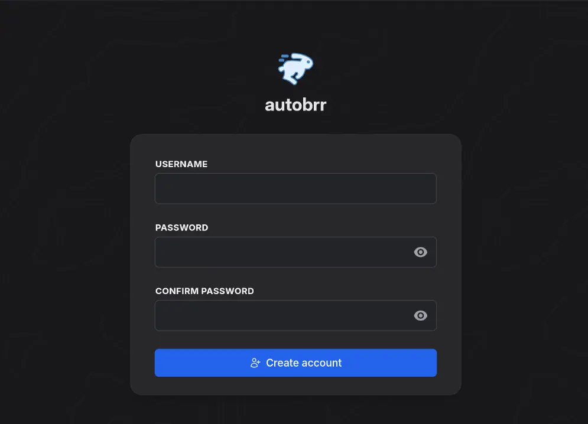

<!--
SPDX-FileCopyrightText: 2020 Aaron Raimist
SPDX-FileCopyrightText: 2020 Chris van Dijk
SPDX-FileCopyrightText: 2020 Dominik Zajac
SPDX-FileCopyrightText: 2020 Mickaël Cornière
SPDX-FileCopyrightText: 2020-2024 MDAD project contributors
SPDX-FileCopyrightText: 2020-2026 Slavi Pantaleev
SPDX-FileCopyrightText: 2022 François Darveau
SPDX-FileCopyrightText: 2022 Julian Foad
SPDX-FileCopyrightText: 2022 Warren Bailey
SPDX-FileCopyrightText: 2023 Antonis Christofides
SPDX-FileCopyrightText: 2023 Felix Stupp
SPDX-FileCopyrightText: 2023 Pierre 'McFly' Marty
SPDX-FileCopyrightText: 2024-2026 Suguru Hirahara

SPDX-License-Identifier: AGPL-3.0-or-later
-->

# Setting up Autobrr

This is an [Ansible](https://www.ansible.com/) role which installs [Autobrr](https://autobrr.com/) to run as a [Docker](https://www.docker.com/) container wrapped in a systemd service.

Autobrr is a modern autodl-irssi replacement, an easy to use download automator for torrents and Usenet.

See the project's [documentation](https://autobrr.com/introduction) to learn what Autobrr does and why it might be useful to you.

## Adjusting the playbook configuration

To enable Autobrr with this role, add the following configuration to your `vars.yml` file.

**Note**: the path should be something like `inventory/host_vars/mash.example.com/vars.yml` if you use the [MASH Ansible playbook](https://github.com/mother-of-all-self-hosting/mash-playbook).

```yaml
########################################################################
#                                                                      #
# autobrr                                                              #
#                                                                      #
########################################################################

autobrr_enabled: true

########################################################################
#                                                                      #
# /autobrr                                                             #
#                                                                      #
########################################################################
```

### Set the hostname

To enable Autobrr you need to set the hostname as well. To do so, add the following configuration to your `vars.yml` file. Make sure to replace `example.com` with your own value.

```yaml
autobrr_hostname: "example.com"
```

After adjusting the hostname, make sure to adjust your DNS records to point the domain to your server.

### Extending the configuration

There are some additional things you may wish to configure about the service.

Take a look at:

- [`defaults/main.yml`](../defaults/main.yml) for some variables that you can customize via your `vars.yml` file. You can override settings (even those that don't have dedicated playbook variables) using the `autobrr_environment_variables_additional_variables` variable

## Installing

After configuring the playbook, run the installation command of your playbook as below:

```sh
ansible-playbook -i inventory/hosts setup.yml --tags=setup-all,start
```

If you use the MASH playbook, the shortcut commands with the [`just` program](https://github.com/mother-of-all-self-hosting/mash-playbook/blob/main/docs/just.md) are also available: `just install-all` or `just setup-all`

## Usage

After running the command for installation, Autobrr becomes available at the specified hostname like `https://example.com`.

To get started, open the URL with a web browser, and register the account.



### Create the first account promptly

Autobrr has no default credentials. Instead, a freshly installed instance is in an *onboarding* state: it accepts an unauthenticated `POST /api/auth/onboard` call from anybody who can reach it, and whoever makes that call first becomes the administrator.

Because this role publishes Autobrr on a public hostname, the window between installing it and creating your account is a window in which a stranger can claim the instance. To prevent it, it is recommended to create your account immediately after installing.

If you would rather not race anybody, you can create the account on the server before the service is ever reachable. To do so, adjust the command below as your playbook sets them, and run it on the server after running `ansible-playbook -i inventory/hosts setup.yml --tags=setup-autobrr` but before starting the service:

```sh
docker run --rm -i \
  --user=UID_HERE:GID_HERE \
  --entrypoint=autobrrctl \
  --mount type=bind,src=AUTOBRR_DATA_PATH_HERE,dst=/config \
  ghcr.io/autobrr/autobrr:AUTOBRR_IMAGE_TAG_HERE \
  --config /config create-user YOUR_USERNAME_HERE
```

The program reads the password from standard input (twice, as a confirmation).

## Troubleshooting

### Check the service's logs

You can find the logs in [systemd-journald](https://www.freedesktop.org/software/systemd/man/systemd-journald.service.html) by logging in to the server with SSH and running `journalctl -fu autobrr` (or how you/your playbook named the service, e.g. `mash-autobrr`).
